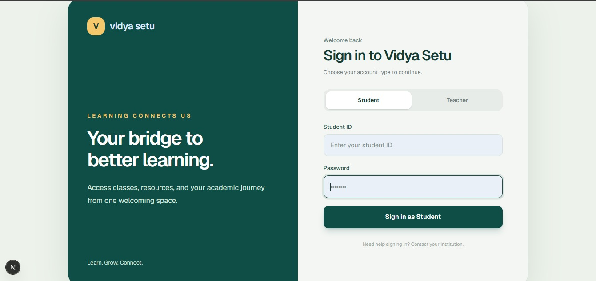
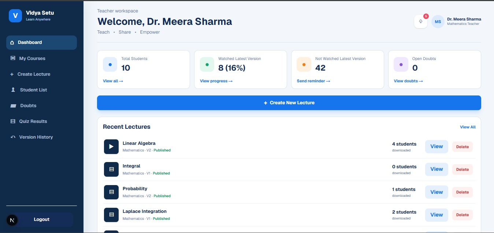
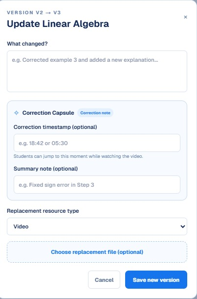
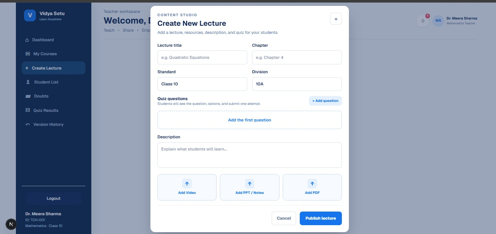
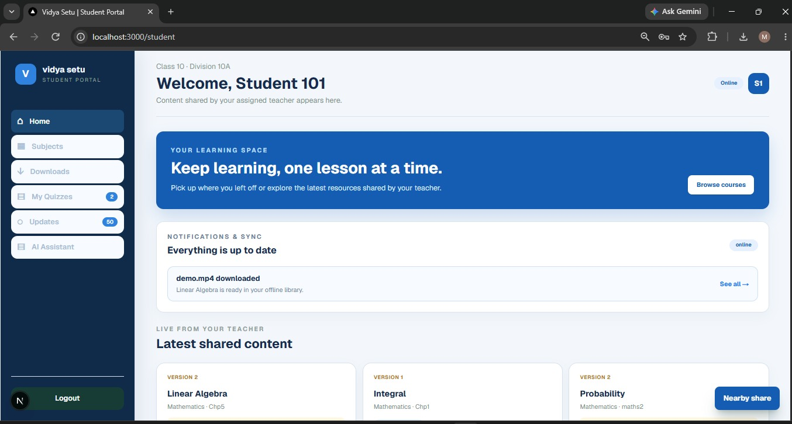
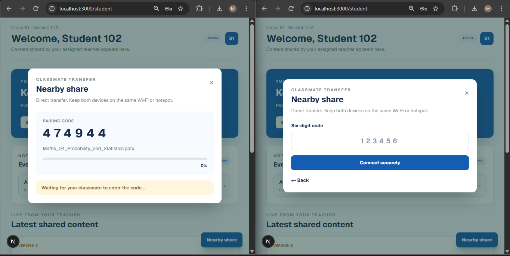

# Vidya Setu

> An offline-first learning platform for classrooms with reliable or limited connectivity.

Vidya Setu gives teachers one place to publish and correct learning material, while students can access assigned lessons, download resources, ask timestamped doubts, take quizzes, and receive verified updates.

## Use Vidya Setu

Students and teachers only need the deployed Vidya Setu link and their login credentials. They never need to install MongoDB, enter database credentials, or provide an AI API key. Those concerns stay inside the server-side backend.

### How the AI chatbot works

The chatbot sends a student’s message to Vidya Setu’s backend, not directly to an AI provider. The backend uses the deployment owner’s server-side provider credentials and returns only the answer to the student. API keys are never shown in the UI, sent to the browser, or requested from a student or teacher.

If the deployment owner has not configured an AI provider, the chatbot remains available in built-in study-coaching mode. That fallback can guide a student through a lesson, but it cannot provide full AI-generated answers.

## Local setup for maintainers

### Prerequisites

- [Node.js](https://nodejs.org/) **20.9+**
- [MongoDB Community Server](https://www.mongodb.com/try/download/community), or a MongoDB Atlas database
- Git

### 1. Clone and install

```powershell
git clone https://github.com/mayuri-nagale/Vidya-Setu.git
cd Vidya-Setu
npm ci
```

If `npm ci` fails because the lockfile is unavailable or has been changed, run `npm install` instead.

### 2. Create the environment file

```powershell
Copy-Item .env.local.example .env.local
```

Open `.env.local` and use the following local-development values:

```env
MONGODB_URI=mongodb://127.0.0.1:27017
MONGODB_DB=vidya_setu
SESSION_SECRET=replace-with-a-private-random-string-of-at-least-32-characters

# Optional app-owner setting: enables full AI-generated answers on the server
OPENAI_API_KEY=your-server-only-openai-api-key
OPENAI_MODEL=gpt-5
```

Only the deployment owner sets `OPENAI_API_KEY`, once, in the server environment. It is not a student, teacher, or browser setting. If it is not set, Vidya Setu uses its built-in study helper. Never commit `.env.local` or expose a provider key in the browser.

### 3. Start MongoDB

If MongoDB was installed as a Windows service, use an elevated PowerShell:

```powershell
Start-Service MongoDB
```

Otherwise, start a local server in a separate terminal:

```powershell
New-Item -ItemType Directory -Force C:\data\db
mongod --dbpath C:\data\db
```

For MongoDB Atlas, put the Atlas connection string in `MONGODB_URI` and allow your application IP address in Atlas before continuing.

### 4. Seed demo accounts and start the app

```powershell
npm run seed:teacher
npm run dev
```

Open [http://localhost:3000](http://localhost:3000).

| Role | Login ID | Password | Portal |
| --- | --- | --- | --- |
| Teacher | `TCH-001` | `teacher123` | `/teacher` |
| Student | `101` | `student123` | `/student` |

Student IDs `102` through `110` use the same password, `student123`.

> The seed command creates or updates demo accounts for Class 10A. Do not use these credentials or run the seed process for a production school database.

### 5. Check that everything works

1. Sign in as `TCH-001` and create a lesson for **Class 10 / 10A**.
2. Sign in as student `101` and confirm that the lesson appears in the student portal.
3. Update the lesson, add the correction details, and verify that the student sees the new version in **Updates**.

## What Vidya Setu does

### Teacher portal

Teachers can:

- create and publish lessons with video, PPT/PPTX, and PDF resources;
- assign lessons to a class and division;
- build quizzes and review quiz results;
- view students, learning progress, and incoming doubts;
- replace incorrect learning material without losing its update history; and
- publish a corrected version with a timestamp and a concise correction note.

### Student portal

Students can:

- view lessons assigned to their class and division;
- download resources and resume an interrupted download;
- access downloaded learning material during low or unavailable connectivity;
- see lesson-version updates and correction notices;
- submit a doubt with the relevant lesson context and timestamp;
- take lesson quizzes; and
- use the optional AI lesson helper while studying.

# My Project










## Future Scope

### Native Android App (Flutter)
Develop Vidya Setu as a full mobile application using Flutter for a smoother and more accessible offline learning experience.

### Smart Storage Management
Improve management of downloaded and partially downloaded lectures by removing outdated versions, managing cache, and helping students optimize device storage.

### OCR + Speech-to-Text
Use OCR to extract text from PDFs, PPTs, and images, and Speech-to-Text technology to convert lecture audio and video into searchable text.

### Teacher Progress Dashboard
Provide teachers with detailed analytics for downloads, learning progress, quiz results, viewed updates, and pending student doubts.

### Version-safe corrections


Vidya Setu treats a correction as an update to an existing lesson rather than an unrelated new upload.

```text
Teacher publishes a lesson
          |
An error is found in a resource or slide
          |
Teacher records the correction timestamp and note
          |
Corrected PPT/PDF/video is uploaded as a replacement resource
          |
A new published version is created and students are notified
```

This helps students understand what changed, where it changed, and which version of the learning material is current.

### Nearby sharing and sync

Students can pair with a classmate using a time-limited six-digit code to transfer an assigned resource nearby. The transfer is restricted to resources assigned to the student’s class and tracks a checksum for integrity verification.

When connectivity is intermittent, actions and downloads can be resumed or synchronized once access is available, helping learning continue without requiring a constant connection.

## Technology

| Area | Technology |
| --- | --- |
| Web application | Next.js 16 and React 19 |
| Database and files | MongoDB with GridFS |
| Authentication | Signed, HTTP-only session cookie |
| Resource types | MP4, WebM, MOV, PPT/PPTX, PDF |
| Study helper | Built-in fallback; optional OpenAI enhancement (server-side) |

Uploaded learning resources are stored in MongoDB GridFS. The application validates supported file types and limits uploads to 100 MB per resource.

## Project structure

```text
app/                    Pages and API routes
  api/auth/             Login and logout
  api/teacher/          Teacher data, lessons, versions, quizzes, doubts
  api/student/          Student lessons, downloads, updates, doubts, AI
components/             Teacher and student portal interfaces
lib/                    Authentication, database, validation, security helpers
scripts/                Demo seed and maintenance scripts
public/                 Static assets
```

## Available commands

| Command | Purpose |
| --- | --- |
| `npm run dev` | Start the development server |
| `npm run lint` | Run ESLint checks |
| `npm run build` | Build the production application |
| `npm start` | Start the production build after `npm run build` |
| `npm run seed:teacher` | Create or refresh demo teacher and student accounts |
| `npm run backfill:notifications` | Create missing notification records for existing data |
| `npm run backfill:learning-versions` | Add version metadata to existing lessons |

## Deployment notes

Before deploying, the application owner configures `MONGODB_URI`, `MONGODB_DB`, and a unique `SESSION_SECRET` of at least 32 characters in the hosting provider’s environment settings. These are backend-only values and are never shown to students or teachers. To enable full AI-generated chatbot answers, the owner also configures `OPENAI_API_KEY` there; users never provide this key.

Use a managed MongoDB deployment for hosted environments, allow only the application’s network access, and replace all demo credentials before sharing the application publicly.

## Troubleshooting

| Problem | What to check |
| --- | --- |
| The app cannot load data | Confirm MongoDB is running and `MONGODB_URI` is correct. |
| Login does not work | Run `npm run seed:teacher`, then use the demo credentials above. |
| Port 3000 is busy | Start with `npm run dev -- -p 3001`, then open `http://localhost:3001`. |
| The study helper gives only general guidance | Add an optional server-side `OPENAI_API_KEY` for enhanced responses, or ask the teacher through a timestamped doubt. |
| Atlas connection fails | Confirm the connection string, database user, and IP access list in MongoDB Atlas. |
